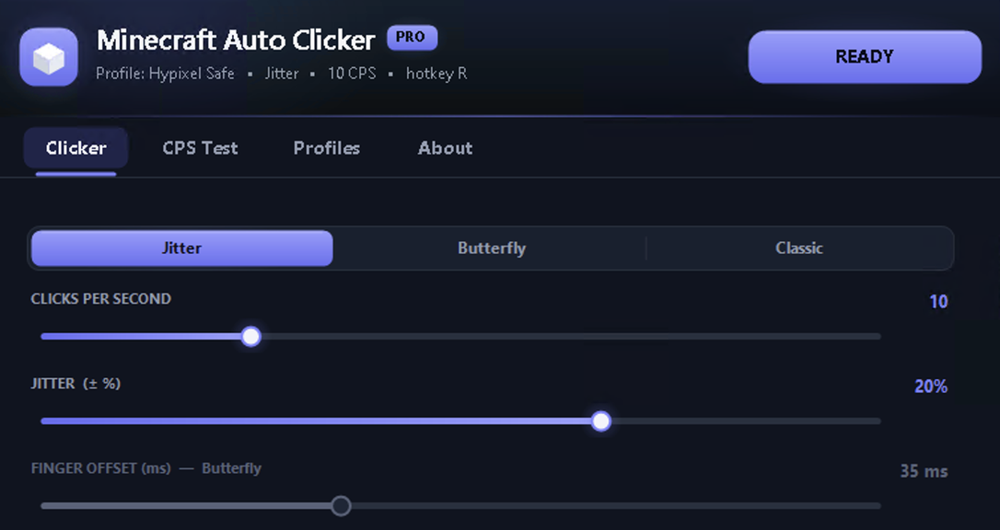

# MC Auto Clicker Pro

*Fast, lightweight auto-clicker for block-based sandbox games.*

---

🚀 **Features**
* **Dynamic CPS Control:** Easily toggle between 1 and 100 clicks per second via the slider.
* **Versatile Click Patterns:** Switch instantly between Classic, Butterfly, and Jitter modes.
* **PvP-Safe Randomization:** Built-in algorithm to randomize click timing, designed to stay under the radar.
* **Hotkey Activation:** Define custom keybinds to toggle your clicking without leaving the action.
* **Standard MSI installer:** Clean install, adds Start Menu shortcut, uninstalls cleanly via Programs & Features.
* **Low Resource Footprint:** Minimal CPU and RAM usage to ensure zero frame drops during intense encounters.
* **Reliable Defaults:** Pre-configured settings to get you into the action immediately.

⚡ **Quick Start**
1. Head to the [Releases](https://github.com/heenll68/mc-auto-clicker-pro/releases) page.
2. Download `MCAutoClickerPro.zip`, extract it, then run `MCAutoClickerPro.msi` to install.
3. Run the application and navigate to the "Settings" tab to map your preferred toggle key.
4. Open your favorite block-game, join a lobby, and press your hotkey to start clicking.

⚔️ **Use Cases**
* **Bridge Building:** Maintain consistent placement speed for rapid bridge construction in sandbox arenas.
* **PvP Dominance:** Use jitter-click modes to maximize your knockback and reach in competitive MC combat scenarios.
* **Resource Farming:** Automate repetitive block breaking or gathering tasks during long survival sessions.

❓ **FAQ**
**Is this software safe to use?**
Yes, the application is designed for local input simulation. However, always check the specific rules of the block-game servers you join to ensure auto-clickers are permitted.

**How do I prevent the clicker from being detected?**
The "Randomization" feature adds a human-like variance to your CPS, which helps mimic manual clicking behavior and reduces the chance of detection by basic anti-cheat systems.

**Will this cause lag in my game?**
The tool is written in C++ with an emphasis on low-level performance. It is optimized to consume less than 0.5% of your CPU, ensuring it has no impact on your game's FPS.

---
*Developed with ❤️ for the block-game community. This tool is provided as-is; use responsibly.*
