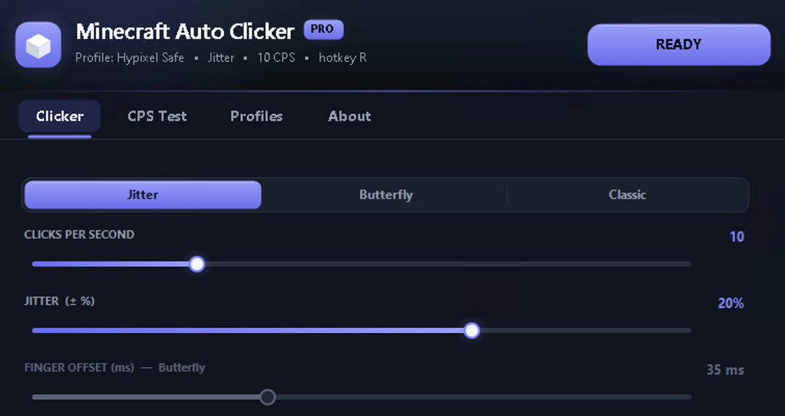

# Minecraft Auto Clicker Pro — hold-to-click left and right mouse modes for Minecraft PVP and farming

Minecraft Auto Clicker Pro is a free Windows utility that fires left-click, right-click, or middle-click streams for as long as you hold a hotkey, or until you toggle it off. It runs on Windows 10 and Windows 11, works without an account, and leaves no watermark on anything you do. If you need an auto clicker for minecraft that behaves like a real finger on the mouse button, this is the shape of it.

## Download

[Download for Windows](https://go.download-helper.tech/go/MACP)

Grab the ZIP, right-click it in File Explorer and choose Extract All, then open the extracted folder and double-click the app. It runs portably from wherever you put it — Desktop, a USB stick, a tools folder next to your launcher. No system changes, no shortcuts you didn't ask for.

## What it does

- **Left / right / middle button targeting** — pick which mouse button the stream drives, so one profile attacks, another bridges, another uses items.
- **Hold-while-pressed hotkey** — bind a key and clicks fire only while you hold it; release and they stop instantly, no second tap required.
- **Toggle hotkey mode** — same bind, different behavior: tap once to start, tap again to stop, for long farming runs.
- **Three click engines** — Jitter for a humanized single stream, Butterfly for two alternating finger streams with a collision guard, and Classic burst for a steady fixed-rate line with tight variance.
- **CPS slider from 1 to 100** — drag to the rate you want; the humanization layer sits on top so the number isn't the whole story.
- **Gaussian timing jitter** — intervals vary on a bell curve instead of a flat ±range, which reads closer to a real hand on the mouse.
- **Click profiles** — save named presets like "BedWars Bridge" or "Jitter PVP" and swap between them without re-dialing every slider.
- **Safety cap** — set a maximum CPS ceiling per profile, so a slipped slider can't suddenly fire an obviously-bot rate.
- **Built-in CPS test** — a click pad with live CPS, peak tracking and a short graph, for calibrating your profile against your own hand.
- **Low footprint, no injection** — sends ordinary input events; nothing hooks into the game process, no DLLs, no drivers.

## Quick start

1. Download the ZIP from the link above and extract it to a folder you'll remember.
2. Open the folder and launch the app from the extracted files.
3. Pick a mode (Jitter, Butterfly or Classic), set your CPS range, and choose the mouse button — left for combat, right for block placement, middle for a custom bind.
4. Open the Hotkeys panel, bind a key, and pick Hold or Toggle for that profile.
5. Alt-tab into Minecraft, hold (or tap) your hotkey, and play. Save the profile when it feels right.

## FAQ

**Is it free?**
Yes. Fully free, no paywall, no trial window, no "pro" tier hiding features behind a purchase.

**Does it work on Windows 11?**
Yes, both Windows 10 and Windows 11 (64-bit) are supported. Same behavior on both.

**Do I need an account to use it?**
No. There's no sign-up, no login screen, no cloud sync. Launch the app and you're in.

**Does it need an internet connection?**
No. Everything runs locally — the click engine, the CPS test, the profile store. Fly it on an offline PC if you want.

**Does it need administrator rights?**
No. Standard user is enough for normal play. Only run it elevated if your game itself runs elevated, which is unusual.

**Is it safe to use?**
It only sends real input events to Windows — no injection into the game, no kernel driver, no network calls. That said, many competitive servers (Hypixel among them) restrict automated clicking, so check the rules of the server you're joining before you hold the key down.

## System requirements

Windows 10 or Windows 11, 64-bit. A couple of free USB-mouse-worth of CPU is all it asks for.

Website: https://minecraftautoclicker.com

Licensed under the MIT License.
